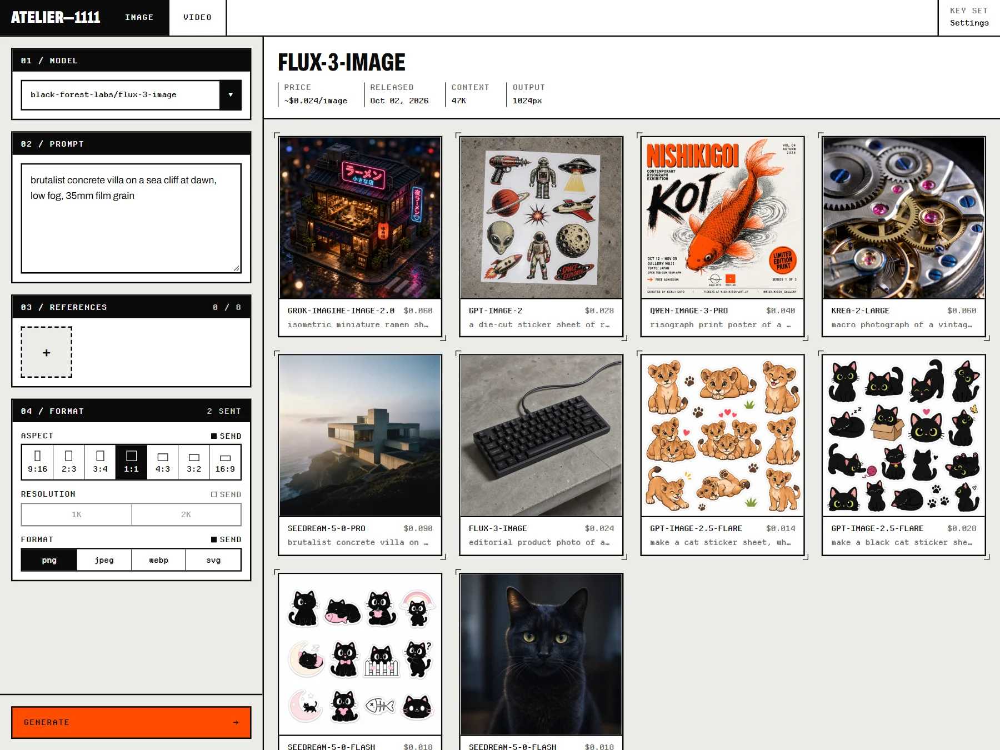

# Atelier-1111

BYOK image and video generation with your own key from OpenRouter, OpenAI,
Google, xAI, fal, Replicate, Black Forest Labs, Luma, ByteDance or Prodia. It
runs on your machine and saves every result to disk with its prompt and, where
the provider reports one, its cost.



## Run it

Needs Node.js 22.5 or later.

```bash
npm install
npm start
```

Open http://127.0.0.1:5180 and paste a key from [OpenRouter](https://openrouter.ai/keys),
[OpenAI](https://platform.openai.com/api-keys), [Google AI Studio](https://aistudio.google.com/apikey)
or any of the providers above. Atelier tells keys apart by prefix and asks
which provider a key is for when it can't. On Windows, you can
double-click `Start-Atelier.vbs` instead.

## What it does

- Lists the image and video models of the active provider. With an OpenRouter
  key that is every model on OpenRouter; with an OpenAI, Google or xAI key, the
  image models that key can use. fal, Replicate, Black Forest Labs, Luma,
  ByteDance and Prodia offer no model list, so they start with a few
  suggestions and you add any other model by its id in Settings. Their keys
  can't be checked for free, so the first image shows whether a key works.
  Keep several keys and switch in Settings.
- Video comes from OpenRouter only for now.
- Takes up to 8 reference images for edits. Paste them, drop them, or send a
  result back in.
- Saves results to `data/images` and their details to `data/atelier.db`.
- Shows what each image cost and, for OpenRouter, what your key has left.
  Other providers report no cost, so none is shown.
- Tracks which settings each model honours. Values a model refuses are struck
  through, and values it ignores are dotted. Hover to see why.

## Your key

Keys are stored in `data/settings.json`, one per provider, and each is only
sent to its own provider. The browser never sees them. The server only answers requests from localhost, so
other websites can't use it.

You can also put a key in a `.env` file under the provider's usual variable,
such as `OPENROUTER_API_KEY`, `OPENAI_API_KEY`, `GEMINI_API_KEY` or `FAL_KEY`
(see `.env.example`). A key saved in the app takes precedence.

## Upgrading from 0.1

The first start of 0.2 stores model ids with their provider
(`openrouter:google/…`), after copying the database and `settings.json` to
`data/backups`. To go back to 0.1, run
`node scripts/downgrade-model-ids.mjs <data directory>` first; 0.1 then finds
its key, gallery and hidden models as before.

## Development

The Tauri desktop app targets Windows and macOS, including Intel and Apple Silicon.
See [desktop build instructions](docs/desktop.md) for packaging and data locations.

`npm run dev` runs the API on port 8788 behind the Vite dev server on 5180.
`npm test` runs the tests.

## License

MIT. The bundled fonts, Departure Mono and Archivo, use the SIL Open Font
License 1.1.
